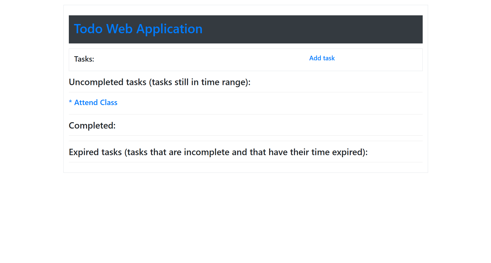

# 📝 Django TaskMaster (Productivity Suite)

A robust, full-stack task management application built with Django. Designed to streamline personal productivity, this application allows users to create, organize, and track daily tasks with a focus on data persistence and user security.


## 🔑 Key Features
* **User Authentication System:** Secure login, registration, and logout functionality using Django's built-in authentication system.
* **CRUD Operations:** Full Create, Read, Update, and Delete capabilities for task management.
* **Database Management:** Utilizes **SQLite** for development and configured for **MySQL** in production environments.
* **Task Prioritization:** Logic to categorize tasks by urgency or completion status.
* **Responsive UI:** Built with **Bootstrap 5** to ensure functionality across mobile and desktop devices.
* **Security:** Implemented CSRF protection on all forms and `@login_required` decorators to protect private routes.

## 🛠️ Tech Stack
* **Backend Framework:** Django (Python)
* **Architecture:** MVT (Model-View-Template)
* **Database:** SQLite (Dev) / MySQL (Prod)
* **Frontend:** HTML5, CSS3, Bootstrap 5
* **Deployment:** Heroku (utilizing `gunicorn` and `whitenoise` for static files)

## 📸 Screenshots


## 💻 Local Installation & Setup
To run this project locally, follow these steps:

1.  **Clone the repository:**
    ```bash
    git clone [https://github.com/Py-God/your-repo-name.git](https://github.com/Py-God/your-repo-name.git)
    cd your-repo-name
    ```

2.  **Create and activate a virtual environment:**
    ```bash
    python -m venv venv
    # Windows
    venv\Scripts\activate
    # Mac/Linux
    source venv/bin/activate
    ```

3.  **Install dependencies:**
    ```bash
    pip install -r requirements.txt
    ```

4.  **Apply Migrations:**
    ```bash
    python manage.py migrate
    ```

5.  **Run the Server:**
    ```bash
    python manage.py runserver
    ```

## 🧠 What I Learned
* How to configure `settings.py` for different environments (Development vs. Production).
* Managing static files in Django using Whitenoise.
* Designing relational database models and using Django's ORM to query data efficiently.
* Debugging deployment errors on Heroku (Procfiles, Buildpacks).

---
*Created by [Boluwatife Leke-Oduoye](https://github.com/Py-God)*
